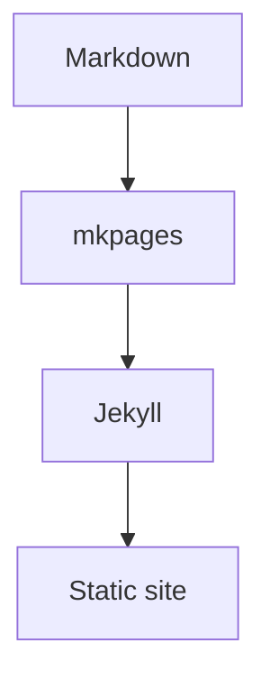

# Getting Started

## Install

Install `mkpages` from PyPI:

```bash
pip install mkpages
```

For local development in this repository:

```bash
pip install -e '.[dev]'
```

## Basic usage

Generate a Jekyll source tree from the current directory:

```bash
mkpages build
```

Generate from a `docs/` folder into `.mkpages/`:

```bash
mkpages build docs/
```

Preview a Markdown tree in one step:

```bash
mkpages preview docs/
```

The same shortcut also works without an explicit subcommand:

```bash
mkpages docs/
```

## What gets generated

The output directory contains:

- `_config.yml`
- `_layouts/default.html`
- `_includes/`
- generated Markdown pages with front matter
- copied non-Markdown assets
- `assets/site.css`
- `.mkpages-output`

Hidden files and hidden directories in the content root are ignored by default.

## Next steps

Once the output exists, point a Jekyll build at it. See
[GitHub Pages](github-pages.md) for a typical workflow.

For local preview with Jekyll installed:

```bash
mkpages build docs/
mkpages serve
```

`mkpages serve` uses the existing `.mkpages` output and opens the preview URL
in your default browser when possible.

## Mermaid diagrams

Fenced code blocks marked as `mermaid` are rendered automatically in the
generated site.


